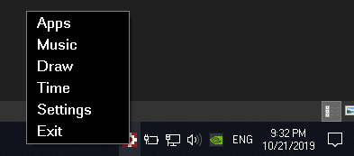
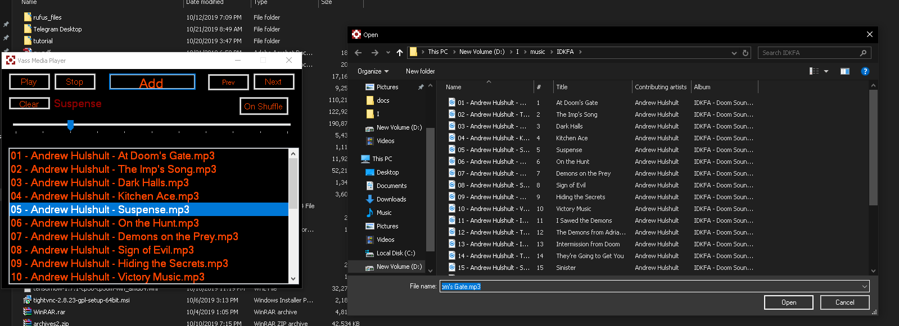
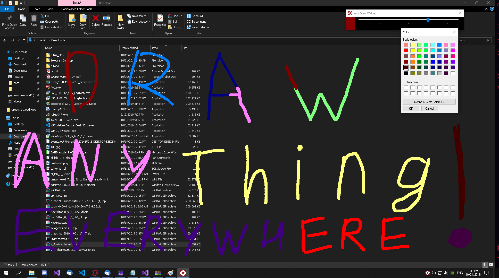
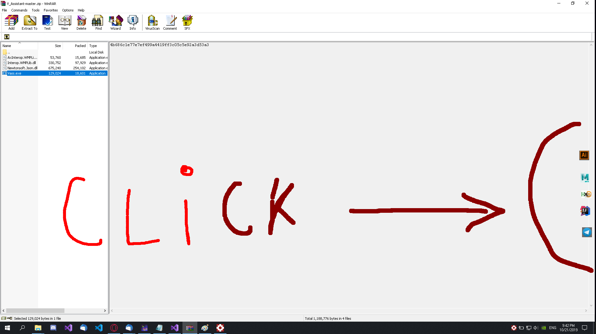

# V_Assistant
Written using C# and WinForms.
This application includes it media-player, timer, stopwatch, tool for quick launch other applications. It also can draw on screen directly. Main advantage of this app is using much less RAM than Windows defaults applications.

Shortcuts:
ALT+X media player
ALT+D clear screen
ALT+A eraser
ALT+Q pallete for on-screen brush
ALT+E toggle on-screen drawing

If you want to try it just download folder with name "Vass" and run exe.

Some screenshots:

1) Main Menu (press right click on icon in tray)

2) Music player ( Alt+X or click in menu)

3) Draw widget that allows you to draw on the other windows

4) Apps located in quick acces (you can launch them by left click or drag to any other position you want with right click)

If you have any questions or propositions, please write me via Telegram @Dushess0 .
Thanks You!
